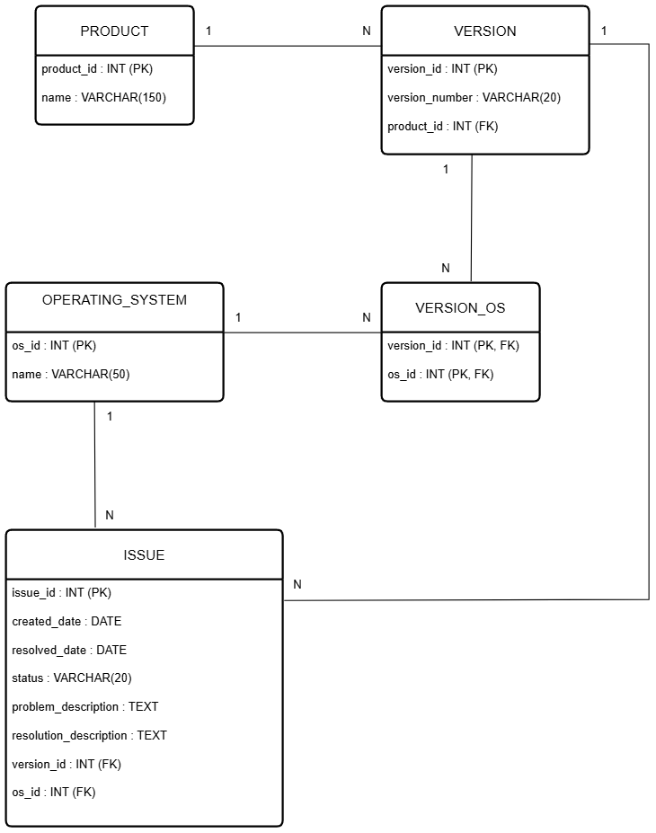

# NexaWorks – Projet 6

## Contenu du dépôt
- Dump complet de la base SQL Server

## Dump de la base
Le dump complet est disponible dans le dossier `database_dump/` :
- `NexaWorks.bak`

## Modèle entité–association

Le diagramme ci-dessous présente la conception logique de la base de données NexaWorks
(produits, versions, systèmes d’exploitation et tickets).

